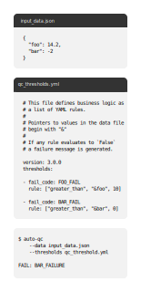

# auto-qc -- A python tool for storing business logic as data.

## Quick Start

```console
pip3 install auto-qc
auto-qc --data <DATA_FILE> --thresholds <THRESHOLD_FILE>
```

## Motivation

Auto QC is designed for business logic where process failures can be determined
with clear thresholds rules, such as "defects per month > 10", but change often
enough that hard-coding them into software with `if/else` or `case` statements
would require regular changes tot he code to adapt them according to moving
requirements.

Auto QC solves this by providing a JSON/YAML data format for the business
thresholds, which are evaluated against metrics stored in separate file. If any
of the threshold rules evaluate to `False`, auto QC will report the
corresponding error code associated with the failing rule.

## Simple Example



### Explanation

Assume metrics for a widget looks like the data below. This kind of data may be
captured during the manufacturing process, or from data aggregated from logs.

```json
{
  "foo": 14.2,
  "bar": -2
}
```

And the threshold rules that the business cares about look like this:

```yaml
version: 3.0.0
thresholds:
- fail_code: "FOO_FAILURE",
  rule: ["greater_than", "&foo", 10]
- fail_code: "BAR_FAILURE",
  rule: ["greater_than", "&bar", 0]
```

Running this with `auto-qc` would report the error `BAR_FAILURE`, because the
value for `bar` in the data file is -2, while the thresholds includes a rule
that the pointer to the value for `&bar` should not be below 0. Every rule
defined in the `thresholds` field should evaluate to `True`. If any evaluate to
`False` then auto QC will return the associated string in the `fail_code`
field.

### More-complex example

More complex examples can be built using Boolean expressions such as `AND` or
`OR`. Assume that the thresholds might depend on the type of widget being
manufactured, where 'cheap' widgets can have more lax thresholds. This can be
handled by encoding the widget type in the data file.

```json
{
  "widget_type": "cheap",
  "foo": 14.2,
  "bar": -2
}
```

Then the thresholds file can use a mixture of `OR` and `AND` expressions to
test the value of `&bar` based on the value of the `&widget_type` field.

```yaml
version: 3.0.0
thresholds:
- fail_code: "FOO_FAILURE",
  rule: ["greater_than", "&foo", 10]
- fail_code: "BAR_FAILURE",
  rule:
  - OR
  - - AND
    - [equals "&widget_type", "cheap"]
    - ["greater_than", "&bar", -5]
  - - AND
    - [equals "&widget_type", "expensive"]
    - ["greater_than", "&bar", 2]
```

## Command Line Options

- `-d`, `--data` <DATA_FILE>: The path to the file containing input data to be
  checked.

- `-t`, `--thresholds` <THRESHOLD_FILE>: The path to the file containing the
  pass/fail thresholds.

- `-j`, `--json-output`: Generate output as JSON.

## Python API

Auto QC can be used in python code as follows:

```python
from auto_qc import main
evaluation = main.run(thresholds, data)
```

## File Syntax

### Source Data File

A data file is a YAML/JSON file containing all the data used to make decisions.
This file should contain nested dictionaries. An example data file might look like:

```yaml
---
manufacturing:
  defective_parts_per_million_per_month: 7
  mean_throughput_per_machine_per_month: 1462.8
customer:
  percent_on_time_delivery: 97.3
  returns_per_month: 31
```

### Source Threshold File

A threshold file specifies the QC criteria or business logic to make a pass or
fail based on the fields and metrics in the data above file. The threshold file
is a YAML/JSON dictionary contains two fields `version` and `thresholds`. These
fields are defined as:

- **version** - This field is checked by auto-qc to determine if the QC
  threshold syntax matches that of the version of auto-qc being run. For the
  current version of auto-qc this should be `3.0.0`. If the `version` field is
  out of date, e.g. `2.x`, then auto-qc will immediately fail.

- **thresholds** - This field should contain a list of dictionaries, where each
  entry defines a rule that should be evaluated against the metrics in the data
  file. The threshold dictionaries are defined as follows in the next section.

### Evaluated Rules

Use the example data above, a simple threshold file with two business rules
might look like:

```yaml
version: 3.0.0
thresholds:
  - name: Dropping throughput rate
    fail_code: ERR_001
    rule:
      - LESS_THAN
      - &manufacturing/mean_throughput_per_machine_per_month
      - 10000

  - name: Increasing defects
    fail_code: ERR_002
    rule:
      - OR
      - [
          GREATER_THAN,
          &manufacturing/defective_parts_per_million_per_month ,
          100,
        ]
      - [GREATER_THAN, &customer/returns_per_month , 10]
```

The first rule 'Dropping throughput rate' checks the value in the data file for
the path `&manufacturing/mean_throughput_per_machine_per_month` ensures it's
greater than `10000`.

The second rule 'Increasing defects' is a compound rule joined by an `OR`
operator, and checks two metrics in the data file to see if either are above a
given threshold file. This second rule illustrates that all business rules are
lists beginning with an operator, and can be arbitrarily nested. The full list of
available operators is given below.

Each evaluation rule dictionary contains:

- **name**: A unique name for this business rule.

- **fail_msg**: A message to generate if this entry QC entry fails. Python
  string interpolation can be used to customise this message with values from
  the data file.

- **pass_msg**: A message to generate if this entry passes. Python string
  interpolation may also be used to customise this message with values from the
  data file.

- **fail_code**: An ID for the kind of failure identified if this entry
  evaluates to fail. The list of failure codes is returned in the JSON output
  with the flag.

- **tags**: A optional list of tags for the QC entry. These tags are returned
  in the JSON output if `--json-output` is used. These have no effect on the
  evaluation of the tool, but can be useful for downstream processing of the
  generated JSON output. E.g. process the failures and group by tags.

- **rule**:

  - **operator** - An operator to test the QC value. This may be mathematical
    comparison operators such as 'greater_than' or Boolean operators such as
    'AND'. The list of allowed operators is described in the section below.

  - **analysis value** - The value from the data file that should be
    tested. The ampersand '&' indicates that this a pointer to a value in the
    data file. The remainder of this string is the JSON path to the value
    to be evaluated against.

  - **literal value** - A literal value that to compare with the reference
    value.

### AVAILABLE OPERATORS

**equals** / **not_equals** - Test whether two values are equal or not.

```yaml
- equals
- &run_metadata/protocol
- Low Input DNA
```

**greater_than** / **less_than** / **greater_equal_than** / **less_equal_than** -
Test whether one numeric value is greater/smaller than another.

```yaml
- greater_than
- &human_contamination/metrics/percent_contamination
- 5
```

**and** - Test whether two values are both true. The example here illustrates
that metrics can be nested. For instance here, the two arguments to the **and**
operator are themselves thresholds.

```yaml
- and
- - greater_than
  - &cat_contamination/metrics/percent_contamination
  - 5
- - greater_than
  - &dog_contamination/metrics/percent_contamination
  - 5
```

**or** - Test whether any values are true.

```yaml
- or
- - greater_than
  - &cat_contamination/metrics/percent_contamination
  - 5
- - greater_than
  - &dog_contamination/metrics/percent_contamination
  - 5
```

**not** - Flips the Boolean value

```yaml
- not
- &cat_contamination/is_contaminated
```

**is_in** / **is_not_in** - Test whether a value is in a list of values. Note
that the list of values must begin with the **list** operator.

```yaml
- is_in
- &cat_contamination/name_of_cat
- - list
  - "Chase No Face"
  - "Colonel Meow"
  - "Felicette"
  - "Mrs. Chippy"
  - "Peter, the Lord's Cat"
  - "Tiddles"
  - "Wilberforce"
```

## Building and Testing

Type `make` to get a full list of available commands for building and testing.
The available commands are:

```console
make bootstrap   Installs python and ruby dependencies locally
make test        Runs all unit tests defined in the test/
make feature     Runs all feature tests defined in the features/
make fmt         Runs black and isort code formatting
make fmt_check   Checks code is correctly formatted
make build       Builds a python package of auto_qc in dist/
```

## Versioning

This project uses bump2version to manage the version numbers. This project aims
to adhere to [Semantic Versioning](http://semver.org/) as much as possible. The
project version history is described in the CHANGELOG. Version strings can be
updated with the shell as follows:

```console
poetry run bump2version patch  # 3.0.0 → 3.0.1
poetry run bump2version minor  # 3.0.1 → 3.1.0
poetry run bump2version major  # 3.1.0 → 4.0.0
```

## Licence

auto-qc Copyright (c) 2017-2021, The Regents of the University of California,
through Lawrence Berkeley National Laboratory (subject to receipt of any
required approvals from the U.S. Dept. of Energy). All rights reserved.

If you have questions about your rights to use or distribute this software,
please contact Berkeley Lab's Innovation and Partnerships Office at IPO@lbl.gov
referring to "auto-qc v2 (2017-031)."

NOTICE. This software was developed under funding from the U.S. Department of
Energy. As such, the U.S. Government has been granted for itself and others
acting on its behalf a paid-up, nonexclusive, irrevocable, worldwide license in
the Software to reproduce, prepare derivative works, and perform publicly and
display publicly. The U.S. Government is granted for itself and others acting
on its behalf a paid-up, nonexclusive, irrevocable, worldwide license in the
Software to reproduce, prepare derivative works, distribute copies to the
public, perform publicly and display publicly, and to permit others to do so.

## AUTHOR

Michael Barton <mail@michaelbarton.me.uk>

## HISTORY

- 3.0.0 - Mon 08 Feb 2021
- 2.0.0 - Mon 20 Jun 2016
- 1.1.0 - Mon 27 Apr 2015
- 1.0.0 - Fri 15 Aug 2014
- 0.2.1 - Tue 20 May 2014
- 0.2.0 - Mon 19 May 2014
- 0.1.0 - Thu 15 May 2014
