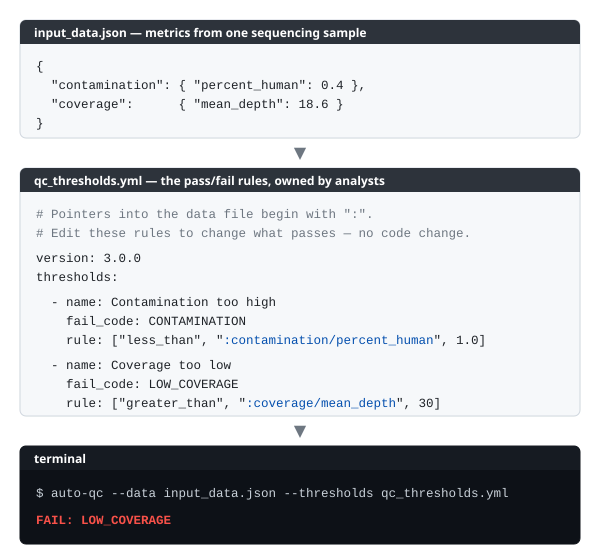

# auto-qc

[](https://github.com/michaelbarton/auto-qc/actions/workflows/tests.yml)
[](https://pypi.org/project/auto-qc/)
[](https://pypi.org/project/auto-qc/)
[](LICENSE.txt)

**Keep your pass/fail rules in a data file, not buried in your code.**

`auto-qc` reads a file of metrics and a file of pass/fail rules, evaluates one
against the other, and tells you whether the metrics pass — and if not, exactly
which rules failed. The rules live in plain YAML/JSON that a non-programmer can
read and edit, so the thresholds can change without touching the pipeline.

## Quick Start

```console
pip3 install auto-qc
auto-qc --data <DATA_FILE> --thresholds <THRESHOLD_FILE>
```

`auto-qc` prints `PASS` or `FAIL: <codes>` and exits non-zero on failure, so it
drops straight into a shell pipeline or CI step.

## Motivation

`auto-qc` came out of running quality control on high-throughput DNA sequencing
at the Joint Genome Institute. Every sequencing run produces a pile of metrics
for each sample — contamination, coverage depth, base quality — and every sample
has to be judged pass or fail against a set of thresholds.

The catch is that those thresholds are not fixed. They move as protocols evolve,
as instruments are recalibrated, and as the lab learns what "good" looks like.
And the people who own those thresholds are the analysts and lab leads, not the
software engineers who maintain the pipeline.

Baking the rules into the pipeline as `if`/`else` statements meant that every
time a cutoff moved, someone had to change code, get it reviewed, and redeploy —
and you still had no clean record of _why_ a particular sample failed.

`auto-qc` pulls that logic out of the code and into a data file:

- **Analysts own the rules.** Thresholds live in a YAML/JSON file anyone can
  read and edit. No code change, no redeploy.
- **The pipeline just runs a command.** It calls `auto-qc`, reads the exit code,
  and optionally parses the JSON report of which rules failed and why.
- **Failures are explained.** Each rule carries a `fail_code` (and an optional
  human-readable message), so a failing sample comes with a machine-readable
  reason instead of a mystery.

Although it was born in a sequencing lab, the same shape of problem shows up
anywhere pass/fail rules change more often than the code around them —
manufacturing tolerances, data-pipeline quality gates, SLA checks, release
readiness. If you have ever hard-coded a threshold and then had to redeploy to
move it, `auto-qc` is for you.

## How It Works



Say a single sequencing sample produces these metrics:

```json
{
  "contamination": { "percent_human": 0.4 },
  "coverage": { "mean_depth": 18.6 }
}
```

And the QC rules the lab currently cares about look like this:

```yaml
version: 3.0.0
thresholds:
  - name: Contamination too high
    fail_code: CONTAMINATION
    rule: ["less_than", ":contamination/percent_human", 1.0]
  - name: Coverage too low
    fail_code: LOW_COVERAGE
    rule: ["greater_than", ":coverage/mean_depth", 30]
```

Running `auto-qc` against these two files reports `FAIL: LOW_COVERAGE`. The
contamination rule passes (`0.4` is less than `1.0`), but the coverage rule
fails because the mean depth of `18.6` is not greater than `30`.

A string beginning with `:` is a **pointer** into the data file:
`:coverage/mean_depth` reads the `mean_depth` field nested under `coverage`.
Every rule in the `thresholds` list must evaluate to `True` for the sample to
pass. For each rule that evaluates to `False`, `auto-qc` reports the associated
`fail_code`.

### A More Complex Rule

Rules are nestable [s-expressions][sexp], so they can combine `and`, `or` and
`not` to express richer logic. Suppose the acceptable coverage depends on the
library protocol, which is also recorded in the data file:

```json
{
  "sample": { "protocol": "Low Input DNA" },
  "coverage": { "mean_depth": 18.6 }
}
```

A single rule can then require a higher depth for standard libraries while
allowing a lower depth for low-input ones:

```yaml
version: 3.0.0
thresholds:
  - name: Coverage below protocol threshold
    fail_code: LOW_COVERAGE
    rule:
      - or
      - - and
        - ["equals", ":sample/protocol", "Low Input DNA"]
        - ["greater_than", ":coverage/mean_depth", 15]
      - - and
        - ["equals", ":sample/protocol", "Standard DNA"]
        - ["greater_than", ":coverage/mean_depth", 30]
```

[sexp]: https://en.wikipedia.org/wiki/S-expression

## Command Line Options

- `-d`, `--data` <DATA_FILE>: Path to the YAML/JSON file of metrics to check.
- `-t`, `--thresholds` <THRESHOLD_FILE>: Path to the YAML/JSON file of pass/fail
  rules.
- `-j`, `--json-output`: Print a detailed JSON report instead of `PASS`/`FAIL`.
- `-m`, `--manual`: Print the full manual and exit.

`auto-qc` exits `0` when every rule passes and `1` when any rule fails or the
input files are invalid.

## Output

By default `auto-qc` prints a single line: `PASS`, or `FAIL:` followed by the
`fail_code` of every rule that failed.

With `--json-output` it prints a structured report that downstream tooling can
consume — the overall result, the list of failing codes, and an entry per rule
with its name, pass/fail state, message and tags:

```json
{
  "auto_qc_version": "3.0.0",
  "fail_codes": ["LOW_COVERAGE"],
  "pass": false,
  "qc": [
    {
      "fail_code": "CONTAMINATION",
      "message": "",
      "name": "Contamination too high",
      "pass": true,
      "tags": []
    },
    {
      "fail_code": "LOW_COVERAGE",
      "message": "",
      "name": "Coverage too low",
      "pass": false,
      "tags": []
    }
  ]
}
```

## Python API

`auto-qc` can also be called directly from Python. `run` takes the parsed
thresholds and data as dictionaries and returns an evaluation object:

```python
import yaml
from auto_qc import main

with open("qc_thresholds.yml") as thresholds, open("input_data.json") as data:
    evaluation = main.run(yaml.safe_load(thresholds), yaml.safe_load(data))

print(evaluation.is_pass)     # False
print(evaluation.fail_codes)  # ['LOW_COVERAGE']
```

## File Syntax

### Data File

The data file is a YAML/JSON file of nested dictionaries containing all the
metrics used to make decisions. There are no required fields — it is just your
data. For example:

```yaml
---
sample:
  id: SRX-4521
  protocol: Low Input DNA
contamination:
  percent_human: 0.4
  percent_phix: 0.02
coverage:
  mean_depth: 18.6
  percent_bases_above_30x: 88.1
quality:
  percent_q30: 91.2
```

### Threshold File

The threshold file specifies the QC criteria. It is a YAML/JSON dictionary with
two fields:

- **version** — Checked by `auto-qc` to confirm the file matches the syntax of
  the version being run. For this release it should be `3.0.0`. If the major
  version is out of date (e.g. `2.x`), `auto-qc` fails immediately rather than
  silently misreading the file.

- **thresholds** — A list of rule dictionaries, each described below.

### Rules

Using the data above, a threshold file with two rules might look like:

```yaml
version: 3.0.0
thresholds:
  - name: Contamination too high
    fail_code: CONTAMINATION
    fail_msg: "Human contamination is {contamination/percent_human}%"
    rule:
      - less_than
      - ":contamination/percent_human"
      - 1.0

  - name: Coverage too low
    fail_code: LOW_COVERAGE
    rule:
      - or
      - ["greater_than", ":coverage/mean_depth", 30]
      - ["greater_than", ":coverage/percent_bases_above_30x", 90]
```

The first rule checks that `:contamination/percent_human` is below `1.0`. The
second is a compound rule joined by `OR`: the sample passes if _either_ the mean
depth is above `30` _or_ at least `90`% of bases are above 30x coverage. This
shows that every rule is a list beginning with an operator, and that rules can
be nested arbitrarily.

Each rule dictionary contains:

- **name**: A unique name for the rule. _(required)_

- **fail_code**: An identifier for this kind of failure, reported when the rule
  evaluates to fail. _(required)_

- **rule**: The s-expression to evaluate. _(required)_ It is made up of:

  - **operator** — The test to apply, such as `greater_than` or a Boolean
    operator such as `and`. The full list is below.

  - **pointer** — A value from the data file. A leading `:` marks the string as
    a pointer; the rest is the `/`-separated path to the value.

  - **literal** — A literal value to compare the pointer against.

- **fail_msg**: _(optional)_ A message generated when the rule fails. Python
  string interpolation can pull in values from the data file, e.g.
  `{coverage/mean_depth}`.

- **pass_msg**: _(optional)_ A message generated when the rule passes, with the
  same interpolation support.

- **tags**: _(optional)_ A list of tags returned in the JSON output. They have
  no effect on evaluation but are useful for grouping or filtering failures
  downstream.

### Available Operators

Operator names are case-insensitive, so `or` and `OR` are equivalent.

**equals** / **not_equals** — Test whether two values are equal.

```yaml
- equals
- ":sample/protocol"
- Low Input DNA
```

**greater_than** / **less_than** / **greater_equal_than** / **less_equal_than**
— Test whether one numeric value is greater or smaller than another.

```yaml
- less_than
- ":contamination/percent_human"
- 1.0
```

**and** — Test whether all arguments are true. The arguments here are themselves
rules, showing that rules nest.

```yaml
- and
- - less_than
  - ":contamination/percent_human"
  - 1.0
- - less_than
  - ":contamination/percent_phix"
  - 0.1
```

**or** — Test whether any argument is true.

```yaml
- or
- - greater_than
  - ":coverage/mean_depth"
  - 30
- - greater_than
  - ":quality/percent_q30"
  - 90
```

**not** — Flip a Boolean value.

```yaml
- not
- ":sample/is_control"
```

**is_in** / **is_not_in** — Test whether a value is in a list of values. The
list must begin with the **list** operator.

```yaml
- is_in
- ":sample/protocol"
- - list
  - Low Input DNA
  - Standard DNA
  - PCR-free
```

## Building and Testing

This project uses [uv](https://docs.astral.sh/uv/) for dependency management and
[ruff](https://docs.astral.sh/ruff/) for linting and formatting. Markdown is
formatted with [prettier](https://prettier.io/) via `npx`. Type `make` for the
full list of commands:

```console
make bootstrap   Installs python dependencies locally
make test        Runs all unit tests defined in test/
make feature     Runs all feature tests defined in features/
make fmt         Formats code with ruff and prettier (markdown)
make fmt_check   Checks code formatting with ruff and prettier
make build       Builds a python package of auto_qc in dist/
```

See [CONTRIBUTING.md](CONTRIBUTING.md) for the development and release workflow.

## Versioning

This project follows [Semantic Versioning](http://semver.org/); the history is
recorded in the [CHANGELOG](CHANGELOG.md). The version number is single-sourced
from `auto_qc/version.py` — bump a release by editing the `__version__` string
there.

## Licence

auto-qc Copyright (c) 2017-2026, The Regents of the University of California,
through Lawrence Berkeley National Laboratory (subject to receipt of any
required approvals from the U.S. Dept. of Energy). All rights reserved.

If you have questions about your rights to use or distribute this software,
please contact Berkeley Lab's Innovation and Partnerships Office at IPO@lbl.gov
referring to "auto-qc v2 (2017-031)."

NOTICE. This software was developed under funding from the U.S. Department of
Energy. As such, the U.S. Government has been granted for itself and others
acting on its behalf a paid-up, nonexclusive, irrevocable, worldwide license in
the Software to reproduce, prepare derivative works, and perform publicly and
display publicly. The U.S. Government is granted for itself and others acting on
its behalf a paid-up, nonexclusive, irrevocable, worldwide license in the
Software to reproduce, prepare derivative works, distribute copies to the
public, perform publicly and display publicly, and to permit others to do so.

## Author

Michael Barton <mail@michaelbarton.me.uk>

## History

- 3.0.0 - Mon 01 Jun 2026
- 2.0.0 - Mon 20 Jun 2016
- 1.1.0 - Mon 27 Apr 2015
- 1.0.0 - Fri 15 Aug 2014
- 0.2.1 - Tue 20 May 2014
- 0.2.0 - Mon 19 May 2014
- 0.1.0 - Thu 15 May 2014
